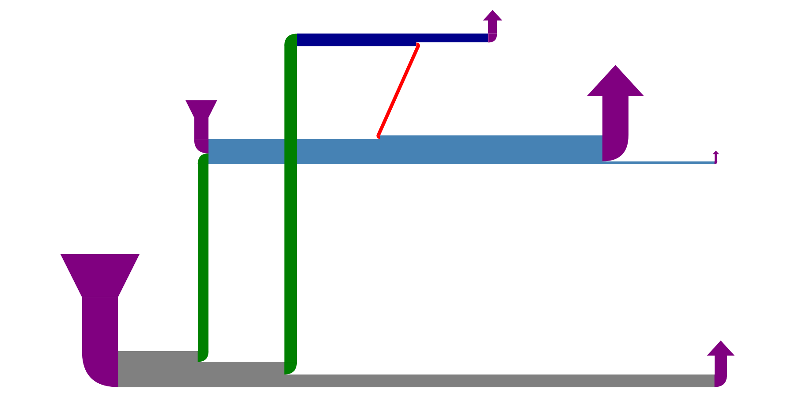

# DYNORDG

Dynamic Ribosome Decision Graphs (RDGs) for simulating and visualizing ribosome flux along transcripts.

## Overview

A Ribosome Decision Graph (RDG) models the possible paths a ribosome can take along an mRNA transcript.

**Dynamic RDGs** extend this by:
- Representing ribosome flux using edge thickness
- Implicitly encoding overlapping translons via flow rather than explicit separation
- Modeling ribosomal phase states based on downstream potential

This package provides tools to:
- Build RDGs from transcript sequences
- Simulate ribosome movement
- Render dynamic flux graphs

## Installation

```bash
git clone https://github.com/k-meiklejohn/dynordg.git
cd dynordg
pip install -e .
```

## Quick Start

```python
from dynordg import Transcript, RiboGraphFlux

# Create transcript
t = Transcript("AUGGCCAUGGCGCCCAGAACUGGGUAA")

# Automatically detect start/stop events
t.auto_stop_starts()

# Build flux graph
graph = RiboGraphFlux(t.transition_map)

# Create render object
plot = RiboGraphVis(graph)

# Render
graph.show()
```

## API Reference

### Transcript

Represents an mRNA transcript.

**Input**
- `sequence` (str): nucleotide sequence (T → U automatically)

**Attributes**
- `events`: nested dictionary of transcript events
- `transition_map`: generated TransitionMap

**Methods**
- `auto_stop_starts()`: detects start/stop codons and assigns probabilities

## Example Output



