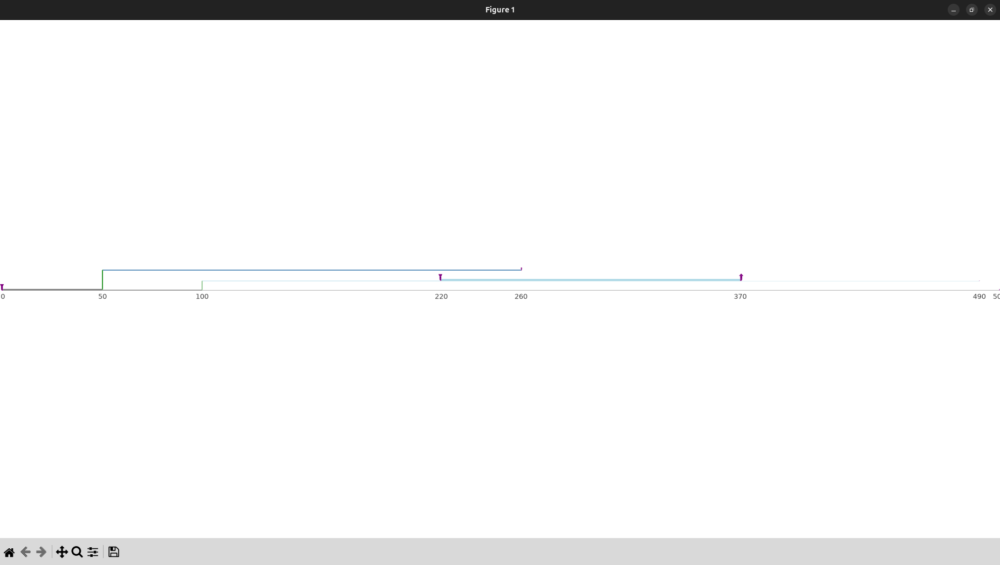
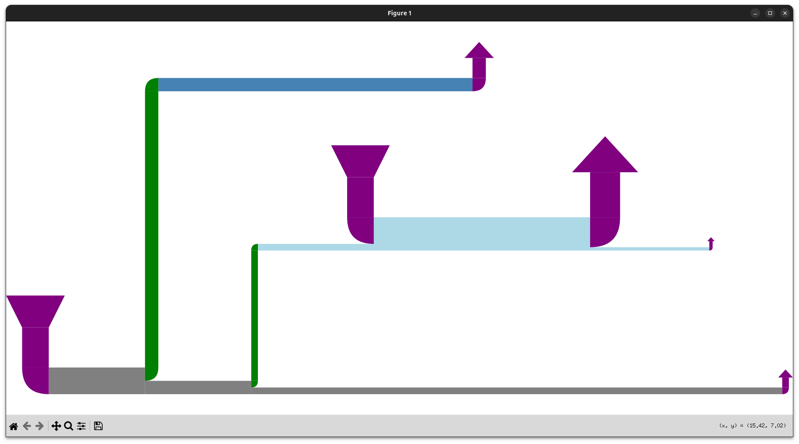
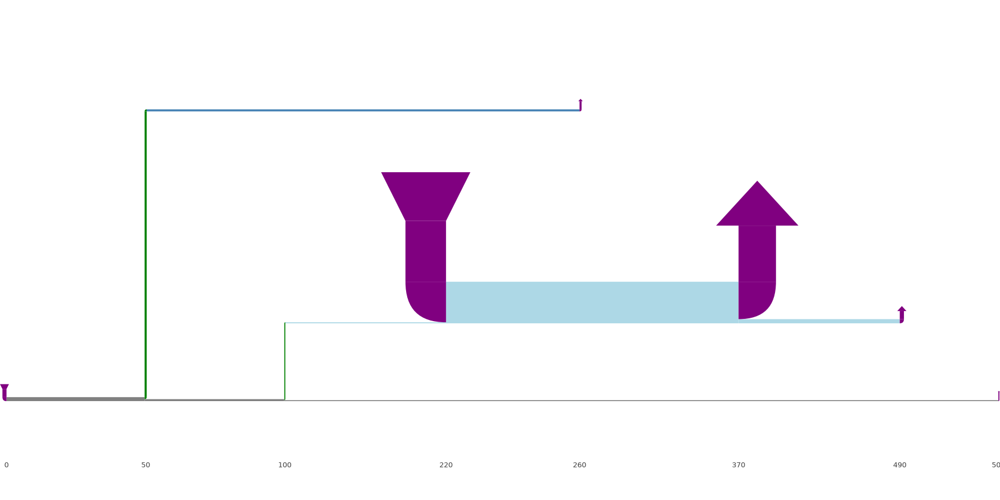
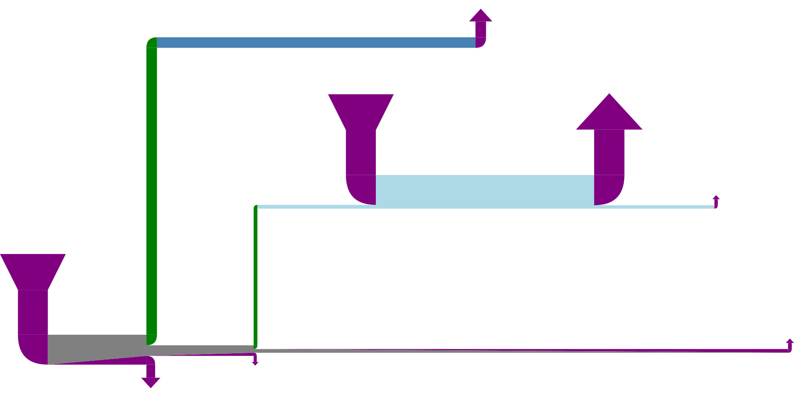

# DYNORDG

Dynamic Ribosome Decision Graphs (RDGs) for simulating and visualizing ribosome flux along transcripts.

## Overview

A Ribosome Decision Graph (RDG) models the possible paths a ribosome can take along an mRNA transcript.

**Dynamic RDGs** extend this by:
- Representing ribosome flux using edge thickness
- Implicitly encoding overlapping translons via flow rather than explicit separation
- Modeling ribosomal phase states based on downstream potential

This package provides tools to:
- Build RDGs from user defined parameters
- Simulate ribosome movement based on user defined behaviours
- Render dynamic flux graphs

EXPERIMENTAL:
This package also provides tools to estimate the probability of translation initiation from sequence based on data from Noderer et al (2014) and Diaz de Arce et al. 2018.

## Requirements
A environment running a recent version of python
Command line access

## Installation
It is reccomended to install this package in a virtual environment such as venv. To do this, run the following (replace dynordg_test with your preferred environment name):
```bash
python -m venv dynordg_test
source dynordg_test/bin/activate
```

Then to install run

```bash
pip install dynordg
```

## Tutorial

### GUI

For ease of use for non-technical users, a simple GUI is provided. Simply run:

```bash
python -m dynordg --gui
```

And the graph can be created with a graphical interface.

### Simple Example
The easiest way to use dynordg is via its __main__.py script, check it is working by running:

```bash
python -m dynordg --help
```

Which will show the help message.

In order to generate an RDG, it must be provided with a CSV in the format position,event,probability. 

- position: a positive integer, expressing the position of the event on the transcript

- event: the type of event that is occuring, must be one of the follwing:
    * initiation
    * termination
    * 40sretention
    * ires
    * frameshift[+/-]d+
        - i.e. frameshift+1, frameshift-22, frameshift+100 etc.
    * loadscanning
    * alldrop

probability: a number x, where 0 < x <=1, except for ires and loadscanning where x can be greater than 1.

An example CSV is as follows:
```
position,event,probability
5,initiation,0.5
10,initiation,0.5
26,termination,1
22,ires,1
37,termination,0.9
49,termination,1
```

Create a file called example.csv with the above contents with the following command.

```bash
echo 'position,event,probability
50,initiation,0.5
100,initiation,0.5
260,termination,1
220,ires,1
370,termination,0.9
490,termination,1' > example.csv
```

now run:
```bash
python -m dynordg example.csv
```

> [!NOTE] 
> The final length of the transcript defaults to the largest position value + 10, but can be defined with the -l/--length option


A window should appear with the graph and looking something like:



This looks a little ugly as the graph is to scale with the transcript. By using the log scale  option (-L/--log_scale) we can adjust the relative distances between decision points. 

```bash
python -m dynordg example.csv -L 5
```

Giving us something a little more readable:



This is a normal MatPlotLib viewing window, and so the normal controls exist, i.e. moving, zooming, saving

To directly save a graph without view just provide an output file (requires either .svg or .png):

```bash
python -m dynordg example.csv -L 5 --output example.svg
```

A SVG is useful for further editing and inclusion in figures.

### Advanced Usage

There are a number of other options that allow finer control over the graph that is produced.

#### Loading Effciency

The loading efficiency of the 5' cap can be adjusted using the -e option. By itself this is not useful, as the largest flux on the graph is normalized to a value of 1. However, when there are other sites in a transcript where ribosomes can load, i.e. an IRES, then this parameter is useful to adjust the relative loading, or even to remove 5' cap loading by setting a value of 0.
For instance:
```bash
python -m dynordg example.csv -L 5 -e 0.1
```

Gives:



#### Half-life behaviours
There are 4 behaviours provided (although more can be specified  - see API reference) to control what happens to the state of ribosomes as they traverse the transcript. The number provided always relates to the distance in nucleotides for half the ribosomes to undergo the specified state change.

##### -t / --translation_decay
The rate at which ribosomes drop off the transcript while translating, default is no drop-off.

##### -s / --scanning_decay
The rate at which ribosomes drop off the transcript while scanning, default is no drop-off.

##### -a / --tc_association
The rate at which ribosomes reassociate with the ternary complex while scanning (necessary for reinititation).
Default is no reassociation.

##### -d / /--sf_dissociaiton
The rate at which scanning factors dissociate from the ribosome while translating, after initiation. (necessary for 40S retention)
Default is no reassociation.


For instance here it is with scanning decay of 100 nucleotides
```bash
python -m dynordg example.csv -L 5 -s 100
```


### Experimental Features

The main function of dynordg is to provide visualisation of graphs based on user inputted data. However features are in development that allow for the automatic assignment of translation paramters based on the sequence of a transcript. These are by no means definitive and care should be taken when interpreting graphs generated with these assignments.

To use these features, a fasta file must be assigned to the transcript using the --fasta option. If this flag is used by itself, then it merely sets the length of the transcript to that of the sequence. The --fasta option makes the usually mandatory option of the CSV now optional, however, if a fasta file is provided with no other flags, the only events added to the transcript are loading at the beginning and drop off at the end.

However by adding the -g / --guess flag, this tells the software to assign probabilities of initiation to AUGs and near cognate start codons based on their surround Kozak sequence, using data from Noderer et al. 2014 and Diaz de Arce et al. 2018. 

By setting the -i / --inititation_limit flag, it sets the minimum threshold of probability when adding an initiation event to the transcript based on sequence (user defined ones always pass).

Similarly the -c / --flux_cutoff parameter determines when the flux of an particular edge is too low and should be redistributed to its sister edges. 

These an both be very useful when dealing with real sequences with many near-cognate start sites.

We can used these to investigate what the DynoRDG of a particular transript might look like, we could use something like:
First get a fasta file, for example:

```bash
echo '>NM_001324323.2 Homo sapiens steroid 5 alpha-reductase 1 (SRD5A1), transcript variant 3, mRNA
CCTTTCTGCAGAGTCCCGGCAGTGCGGGACTCCGGTAGCCGCCCCTCCGGTAGCCGCCCCTCCTGCCCCC
GCGCCGCCGCCCTATATGTTGCCCGCCGCGGCCTCTGGGGCATGGAGCACGCTGCCCAGCCCTGGCGATG
GCAACGGCGACGGGGGTGGCGGAGGAGCGCCTGCTGGCCGCGCTCGCCTACCTGCAGTGCGCCGTGGGCT
GCGCGGTCTTCGCGCGCAATCGTCAGACGAACTCAGTGTACGGCCGCCACGCGCTGCCCAGCCACAGGCT
CCGAGTGCCGGCGCGGGCCGCCTGGGTGGTGCAGGAGCTGCCCTCGCTGGCCCTGCCGCTCTACCAGTAC
GCCAGCGAGTCCGCCCCGCGTCTCCGCAGCGCGCCCAACTGCATCCTCCTGGCCATGTTCCTCGTCCACT
ACGGGCATCGGAAATGTTGGTATGCAAGCACTTGCAGTGTGCCTACATCCCAAATGCCAGCCCATGGTAC
CCATTGTCTGCCCGGATCTGAATCATGATTCCAAGACGCAGAGAGAAATTGCTGGGATTCGTTGTTCTTA
TTCATTGCTTGGCAACACTGCAGCTTCCAGGAGAATACCCACCTCACTGATGACACAACATCTGAATGCA
CACTTACTGGCCAACACGTGCTTTGCTGTAAATCAGTATGAAGTCTTCCTAGGGGTCCTGGCCTGAATGA
GATGAGAACCTTGGAGGCTGCTTTTGACTCATGTGAATGTCTTCCCCAGGAGTTAAGTGGGAGTGCTGGG
GAGAGAGTGGCTTGAGGATGCACAGCCAGCATGACACTACTATTATGTGATTACTGTCGACGTTCATAAC
CATAACTAATGACTAATTATGACTTTACCCTGGCGCACATGGTCAGAATGGAAACAAATAACAAGCTTTA
CAGTTTTTCCTGCTCTATTAAGGTGCTTAATTTACCCATTTCTGATGCGAGGAGGAAAGCCTATGCCACT
GTTGGCGTGTACAATGGCGATTATGTTCTGTACCTGTAACGGCTATTTGCAAAGCAGATACTTGAGCCAT
TGTGCAGTGTATGCTGATGACTGGGTAACAGATCCCCGTTTTCTAATAGGTTTTGGCTTGTGGTTAACGG
GCATGTTGATAAACATCCATTCAGATCATATCCTAAGGAATCTCAGAAAACCAGGAGATACTGGATACAA
AATACCAAGGGGAGGCTTATTTGAATACGTAACTGCAGCCAACTATTTTGGAGAAATCATGGAGTGGTGT
GGCTATGCCCTGGCCAGCTGGTCTGTCCAAGGCGCGGCTTTTGCTTTCTTCACGTTTTGTTTTTTATCTG
GTAGAGCAAAAGAGCATCATGAGTGGTACCTCCGGAAATTTGAAGAGTATCCAAAGTTCAGAAAAATTAT
AATTCCATTTTTGTTTTAAGTGCGTTTTTCATGAAATTATCTTCAACTTGAAGCTTTCCAATGGCGCTTC
TCTATGGACTTTGTAAATAAGTTATATCTTTGTAATTTTCCTGCTACTTTATCATTTTCAAGATGTCCTC
TAGGAATTTTTTTTCTAGTAATTTTGCAATCTACCTAATAAGTACCTAAATACGCTGAAATGGAGGTTGA
ATATCCTACTGTGTAACAGGTCAGAATTTCAAGCTCTGGGTAATAACTGCTGATATTTTTTCTAATTTCA
AATTTACCTCTTTTGGCTATGTCTTGCCAAGTGTGTATGAGACTAGACTTTACAACTGTCTTTGATGGCA
TTTTCAGAACAATAAATGTCACAATCCCTTCTATAGCCCCCTACAGTGATCTCTTCAAGGTCAACTGCAG
TGTTGCTTCCCTCCCCCTATAGGGCTGGAATCTGTCTAGGAGCCCTCTCTCGGAGGCCACAGAGGCTGGG
GGTAGCCATTGTGCAGTCATGGCCCGGGGGAAACTTGCCAACCTTCGTGTCAGGTGCTGTGTGTAAGTGG
AGAACTTGGGGATAGAGGAGGAAGCTCCTCGTGGCCCTTCCAAGGTGAGGCAAAGGCATCTGGACTTGTT
CCAGCCCAGCCCACCGGGTGACATCACCGGGCAGGGAGGGGTGCTGGTGGTGGTTCATACGGAGTAAGCT
GCTCTGCCTGTGTGAGTGGCTCCTGGGCCCTAAACAGGCACCTTTAGGCCATGGGTCACTCACCGTGAGC
CATCAATGTGCTCTGGTCTGACATGGTTTCTCTCTGTCTTCTAGTCTAGACCTAGTTTTTTTGTTCTGTT
CCCCACGTATGGATATAGTAGAGATTGTTGTCTGTGAAATTTCTCTTTTGTAGATTTTGAGTTTTCCCTT
GTAGTGTAAAGAATGATCACTTTCTGTAACAATAACAAGACCACTTTTTAAGATTTATCCTGTTTGTTCT
TTGTTGATTGAAACATAATAATTGTTAAAATTCTCTACAGCCTTCTTTTTCTTCCATAGCTAATCTTCCT
TCTAATAGTTTTTGCTTTCTGTTTTGCTGTTGTTGCTTTGCAAAGCTTTCCCCTCATAGCCTGTACCTGT
TATCAATATAAAATAATCTTCCTGTTGAATGCTTCATGACTTGAATTCTACTTTGATAAAAACATTGCCA
TACTGCTTTTTATCTTGATGAATTCATCTGGCATTGCTTTGCCTTATCATCTCATCTGGAGTTTTTAAAT
GCCATTTGTTTCAGTTGTCTTTAACAACATAATAAATAGACTTTGCCATTTAACAAGGTAGCTCAAATTC
TTTTACTAATTGTTACATCGAAACATTCTTTCATCATATTTCCTGTTTTTATTTGGTTTTTTCAACTTCT
TCTGTTTACTATCTACAGTGATTTGGAAAGGAGATTTCCTTTAAAACAAACAAGCTTATTGGGAATGGCT
TTTATGATTTTTAAAGTAGCCTTGAGAGCTTCCAGTTAAATCTGATGAGCTGAACATACACCTTTCCTTC
TCCCCTCTCTATTCTGACCCCAGTTGAAATCACCTCAAAGGAATTTAGGTGGGGGAGTGGCCCCATAAAG
AGAGTGAGAGAGAGTCACCACTGCAGATGGACCACAGCACGGGTGGAGATGGGCCTGATGTGGCAGAGCA
GAGAGGCCATGACAGTGCACACCCTGCGGAGACCCTGGGTCCTCACATCTGGGCTGACAGAAGGCAGAGG
GAAATGAGCATCTCAAAGTGAGACCAACTAAACATGGCGCCTGCAGCAGAAAGCAGTGTCCTCTGCACCC
CCACTCTCCAGGGAGAGCACAGAGAGCCCAGAAATGAGCCATGTGCCCATTGCCGGGGAAGAGAAGGTAG
GCTGAGGAGGTGGCCTTTCCTAACACAAAAATTAACTAAGTGGGGAAAACCAGAGAACTAGGTGTTGGCA
TCCCAGGAAAAAAATAAAGTCTCCACATTTTGGCCTATAGGGATCCTGCCCCATAATGGCTGGTTACCTC
CTGCCTCAAGCTGCAGGGAAGCCAGGGGGTGGCATGGCCATGGCTTCTCCCTCAGAGAGGCCTCTGTGCA
CGACTTCAGTCACCCAACACTGACAGAACTTGGAACCCAAAAGCCCATTTCTCTCCTTCCGTCCAGACCC
TGTCTGCTGTTATCTGTAGGAAGACCACAGCCAACTGCTATCATGACCAAAGCTAAAATCCAATGAGGCA
GAGAACAATAGTTGTACCCATCTCCTCCTTAGTCTCCAAGGCCAGCGGTGCATGCATTTGTGCATTCAAC
AACATTTGCCAAGCACTTACTGTATATCAAGCACAGCAGTGGGTGCTGAGGACGGATGGGTAGAAAAAAC
AGTCCTGGCCCAGGTGGAGTGACAGGTAAGAAACAAGTAAGTAGCTAAAATAATGTTAGGTAGAAAAAAA
TAACAAGAATAAAAGCAAGGAAAAGGGAAGGGACCCTCACTTGTGTCTGATACAGCCATAATCTTCTCTA
TCGGCCATTGCTGTAACCAAAGCTTAACCACCTTTCTTAAGATATTGATCAACCAGATCATTGCAAATAC
TGCTAATTGATTCCTTTTTATGGCTGAGTAGTATTCCATTGTATATATATATATACCACTTGTTGACTGA
TGGGCATTTGGGTTGGTTCCACGATTTTGCAGTTGTGAATTGTGCTGCTATAAACATGTGCGTGCAAGTA
TCTTTTTTTGAATAATGACTTCTTTTCCTCTGGGTAGATACCCAGTAATGGGATTGCTGGATCAAATGGT
AGTTCTACTTTTAGTTCTAAGGAATTTCCACACTGTTTTCCATGGTGGCTCTAATAGTTTACATTCCCAC
CAGCAGTGTGGAAGTGTTCCATGATTGCCGCATGCATGCCAACATCTACTGTTTTTTGATTTTTTTGGTT
ATGGCCGTTCTTGCAGGAGTAAGGGGGTATCGCACTGTAGTTTTTATTTGCATTTCCCTGATCATTAGTG
ATGTTGAGCATTTTTTCATACTTTGTTGGCCATTTGTATATCTTCTTTTGAGAATTGTCTATTCATGTCC
TTAACCCACTTTTTGATGGGATTGTTTGTTTTTTTCTTACTGATTTGTTTGAGTTTGTTGTAGATTCTGG
ATATTAGTCCTTTGTCTGATGTATAGATTGTGAAGATTTTCTCCCACTCTGTGCGTTGTCTGTTTACTCT
GCTGACTGTTGCTTTTACCATGCAAAAGCTCTTTAGTTTAATTAAGTCCCATCTATTTATCTTTGTTTTT
ATTGTTGGAAACTATTATTCTAAGTTAAGTAACTCAGGAATGGAAAACCAAACAACCTATGTTCTCATTG
ATATGTGGGAGCTAAGCTATGAGGACACAAAGGCATAAGAATGGTACAATGGACTTTGGGGACTTGGGGG
GAAGGGTAAGGGGGGGTGAGGAATAAAAGACAACATATATGGTATAGTATATACTACTCAGGAGATGGGT
GCACCAGGATCTCACAAATCACCACTAAAGAATTTACTCATGTAACCAAATACCACCTGTACCCCCAATA
ACTTATGGGAAAAAAAGATATTCATCGACCTATTCCAGGTCCTCTCTCCACCACTGAGCCTCGTGGGGAC
ATAAAGAGCTGCCTGCCCTCCCCTGTTCCCCTTGCCTTTTTGCAGCAGGATTCCTGAAAATGTTGACTTA
CAGATACGTTTTTGAGATATGAACGTTTGTTATTTCCTGGTGCTTAGGGAAGAAAATAATTGATGTTGTG
AGTTGGGCGGGACTTTAGGGACTATGCTGAACAATCCACTGACCACTGCAGGCTCCCATTTATGATCTTG
GGCCAACAGCCACCAGCCTCTGTTCATGCAGTCTCACTGAGGGCAGTTACTTCTTTGGAGTGGCATGCCT
CTGAGCAGATAATTCCAATAATCAATGTCAAACTAGATATTGAAACAGCCCAAGTGTCCTGGTAAAGCTA
GCTGTTGATACTCCTGACTGTTGCATTATTTTGTTTTTTGTTTTGTTTTGTTTTGAGACGGAGTCTTGCT
CTGTCACCCAGGCTGGAGTGCAATGGTGCGATCTTGGCTCACTGCAAGCTGTGCCTCCCGGGTTCAAACA
ATTCTTCTGCCTCAGCCTCCCGAGTAGCTGGGATTACAGGTGCATGCCACCATGCCCAGCTAATTTTGTA
TTTTTAGTAGAGACAGGGTTTCACCATGTTGTCCAGGCTGGTCTTGAACTCCTGACCTCAAGTGATCCAC
CCACCTTGGCCTCCCAAGGTGCTGGGATTACAGGCACAAGCCACAGCTCCCGGCCCAACTGTTGCATTAT
TATTTGCAAATGTTGGCTATCCCTGCTGTTGTCTATATATCAATTTTGTCTACCCAACACAGCTGTAAAC
TTCTCAAGGTGAGGAGTGAGCCATCACTCTTTGCACCTCTTGCTGTGATTGACATGGTATACCTTAAGAT
ATATGTTAATTCCTATGTCTTAATAAATATTGGCTTATGGAGAATTTGTTGGAGCAAGTACAGACCCTAT
GTTTAACTTCTTTTATTCAACAGAATTAAAAAACTAGCTAGTTCTCTCAATAAAATAATACTTTCTTTTC
TTTCTTAAAATCTAGCTGATCTGGTCTAAAATACACATGTGGGAGGCGGGATTGTAGAAATATCTCAAAT
TAATTAGCGTCTAGCTCTTTGTAAGGTAATTGACAGTCTGAGTTAGTTGCTTCCCCCACTGCAAAGCAGC
AAAATCTGCTCTCAAAGGCTTCACGTAGCCGGGAAAACTCCGTTCCCAATTCAGATCCTCTGGGGAGGGC
ATCAATTATTTCCTATTGTTTTTAGCACCGATTGTTCTGTCTAATTTGAAAGGATCCAAAAAAGGAAATG
ATACTTGGCATTAGTATCATTCTCCATCACTCTTGAAAGATATATGAAGGGAATGTTGGCGCAATCAGTC
TAGAAACATATTTCTCCCATAACAATAAGCCAGTTCTTTTTGCTTTGAATCAGAAATAGCTCCATCAGGC
CCATGAAGGAAAGGGAAACAAAACTGAGTGCCAAGCATATGATAACATGCTCAGCATCATATGACATTAG
GGGATTGCAAATTGAAACAACAGTACCACCACACACCTATCAGAATGGCCAAAATCCAGAAGACTGACAT
CACCAATGCTAGTGAGAATGTGGAGCAACAGGAACTCTCATTCACGGCTGGTGGGGATGCAAAGTGGTGG
AGCCACTTGGGAAGACAGTCTGGCAGATTCCTAAAAAGGTAAACATACTCTTACTAAACAATCTAGTAGA
TTTGCTCCTAGGTGTTTACCCAAAGGAGTTGAAAACATGTCCACACAGAAAACCTGCACATGAATGTTTA
TAGCAGCTTTACTCAAAATTGCCAAAAATTGGAAGCAACCAAGATGTCCTTCAATAGGTGGGCGGATAAA
GAAATTGTATCCAATTCTATTTCTATGAGGAAAATCTATTCATACAATAGAATACTAGTGTCAGAGATTT
TTTTTTAACAAAGAGCTATCAAGCCATGAAAAGATAAGGAAGAACTTTAATGCATATTGGTAAGTGAAAA
AAGCCAGTTTGCAAAGGCTAGATACTATATGATCCCAACTGTATAACATTCTGAAAAAGGCACAACTATG
GAGACAATAAAAAGAACAGAGTTTTGGATGAAGGGAGGGATGAACAGGCAGAATACAAACAAATTTTAGG
GCAGTGAAACTATTATTATGATACTTTATGGATATAGAATATTATGCATTTTTCAAAACACATAGAATAT
ACAACATGAAGAATGAATGCTAATGTAAACTCTGGATTTTTATTAATAATATTATTTAATTAAAATGATT
TATTTTACTTATTTTCATTATTATCTAAAATGTTATTTAATTATTAAATTTAGATGCTACTTAATTTTTG
CTTTATTATTATTATGTTAATATCATCAACTGTAACTAGTGTACAACACTAATGCAAGATGTTAATAGGG
GAAATCGTGTTGGAGAGAGAGATATGTGAGAACTCTGTACTTTCTTTTCAATGTTTCTGTAAACATAAAG
CTGCTCTAAAAAATTAAATCTATTAAAAAAAAAACTGAGTGGAAAAA' > srd5a1.fasta
```

Then use dynordg to assign probabilities to start sites, and generate a graph (don't forget to include the -g flag): 

```bash
python -m dynordg --fasta srd5a1.fasta -g -c 0.1 -i 0.1 -L 5
```

## API Reference
Read the API reference [here](https://github.com/k-meiklejohn/dynordg/blob/main/docs/API_REFERENCE.md), for more information on how the software works and how it can be extended to suit the users needs.

## Example Output

Below is example dynamic RDG (if not a realistic one):


