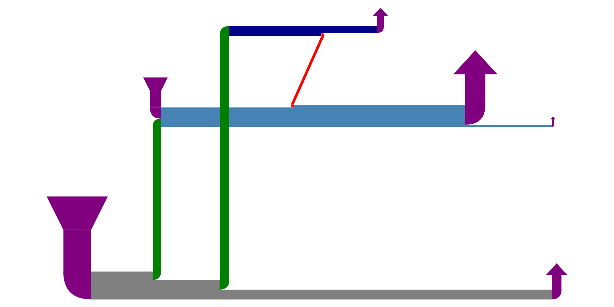

# DYNORDG

Dynamic Ribosome Decision Graphs (RDGs) for simulating and visualizing ribosome flux along transcripts.

## Overview

A Ribosome Decision Graph (RDG) models the possible paths a ribosome can take along an mRNA transcript.

**Dynamic RDGs** extend this by:
- Representing ribosome flux using edge thickness
- Implicitly encoding overlapping translons via flow rather than explicit separation
- Modeling ribosomal phase states based on downstream potential

This package provides tools to:
- Build RDGs from transcript sequences, or from user defined phase transistions
- Simulate ribosome movement
- Render dynamic flux graphs

## Installation

```bash
pip install dynordg
```

## Quick Start

```python
from dynordg import quick_plot

# Creat Render Object
plot = quick_plot("AUGGCCAUGGCGCCCAGAACUGGGUAA")

# Render
plot.show()
```
## API Reference
Read the API reference [here](https://github.com/k-meiklejohn/dynordg/blob/main/docs/API_REFERENCE.md), for more information on how the software works and 
how it can be extended to suit the users needs.

## Example Output

Below is example dynamic RDG (if not a realistic one):




